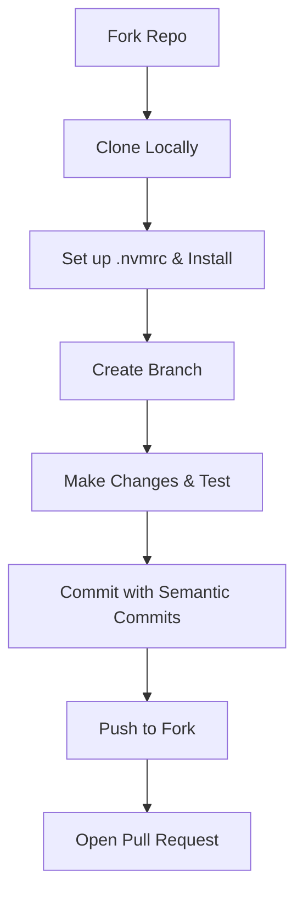

# NexaSphere Contributing Guidelines

First off, thank you for taking the time to contribute to NexaSphere! 🎉

NexaSphere is the official tech community platform for the GL Bajaj Group of Institutions, Mathura. It is built **by students, for students**, and it thrives on the active participation of the open-source community. Whether you are fixing a typo, resolving a critical bug, redesigning a UI element, or proposing a major feature, your help is incredibly valuable.

By participating in this project, you agree to abide by our code of conduct and contribution workflow. Please read this document carefully before making any contributions to ensure a smooth and efficient review process.

---

## 1. Code of Conduct

We are committed to providing a welcoming, inclusive, and harassment-free experience for everyone, regardless of background, identity, or skill level.

*   **Be Respectful**: Treat other contributors with respect, empathy, and professional courtesy. Constructive criticism is welcome, but personal attacks or dismissive behavior will not be tolerated.
*   **Collaborate Openly**: Share knowledge and help others learn. Open-source is about community growth.
*   **Report Concerns**: If you encounter unacceptable behavior, please report it immediately to the maintainers or via the official contact details in [CODE_OF_CONDUCT.md](CODE_OF_CONDUCT.md).

For detailed rules and guidelines, please review our full [Code of Conduct](CODE_OF_CONDUCT.md) file in the repository root.

---

## 2. Security Guidelines

Security is a shared responsibility. All contributors must follow these critical guidelines to prevent credential leaks and protect the integrity of NexaSphere.

### Never Commit Credentials

Under no circumstances should any credentials be committed to this repository. This includes:

*   **Passwords** for admin accounts, test accounts, or service accounts
*   **API Keys** for third-party services (SendGrid, Stripe, AWS, etc.)
*   **Database connection strings** with embedded passwords
*   **OAuth tokens** or refresh tokens
*   **SSH keys** or private certificates
*   **Email addresses linked to real accounts** (use placeholder test emails like `test@example.com`)

**Credential exposure is a critical security vulnerability** that puts the entire platform at risk. Even "test" or "demo" credentials must never be hardcoded in public repositories.

### Proper Credential Handling

**For Local Development:**
1. Create `.env` files from provided `.env.example` templates
2. Never commit `.env` files (they are listed in `.gitignore`)
3. Populate `.env` files with your own local or test credentials
4. Use generic placeholder credentials for shared documentation (e.g., `admin@example.com` instead of real emails)

**For Test Credentials Documentation:**
- Document test account credentials in **private channels** (internal wiki, Notion, Discord DMs)
- Do NOT include credentials in README files, issue descriptions, commit messages, or repository metadata
- Provide instructions for contributors to generate or request test credentials rather than publishing shared credentials

**For CI/CD Pipelines:**
- Use GitHub Secrets to store production credentials
- Reference secrets in GitHub Actions workflows using `${{ secrets.SECRET_NAME }}`
- Never log secrets in CI output
- Rotate all credentials after any accidental exposure

### Secret Scanning

Before committing, ensure no secrets are included:

1. **Pre-Commit Hook** (Recommended):
   Run `npm run format` and `npm run lint` which catch common secret patterns:
   ```bash
   npm run lint
   ```

2. **Manual Verification**:
   Review your diff carefully:
   ```bash
   git diff
   ```
   Look for any password-like strings, API keys, or credentials before pushing.

3. **After a Commit** (Emergency):
   If you accidentally commit credentials:
   ```bash
   # 1. Rotate the exposed credential immediately
   # 2. Force push to your branch (if not merged):
   git reset --soft HEAD~1
   git restore --staged filename
   # 3. Report to maintainers immediately
   ```

### Reporting Security Issues

If you discover a security vulnerability (including credential exposure):

1. **Do not create a public issue**
2. **Do not mention the vulnerability in pull request comments or commit messages**
3. **Report directly** to the maintainers using one of these methods:
   - Email: See [SECURITY.md](SECURITY.md) for contact information
   - Private GitHub issue: Use the repository's private reporting feature
   - Discord: Contact @Ayushh-Sharmaa directly

### Environment Variable Naming

For clarity and to prevent accidental exposure, follow this naming convention:

*   **Public configuration**: `VITE_*` (safe to be visible in client bundles)
*   **Server secrets**: `*_SECRET`, `*_KEY`, `*_PASSWORD`, `*_TOKEN` (strictly server-side only)
*   **Database credentials**: `DB_HOST`, `DB_USER`, `DB_PASSWORD` (keep private)

Example:
```env
# Safe for frontend
VITE_API_URL=https://api.example.com
VITE_VERSION=1.0.0

# Secret, server-only
SENDGRID_API_KEY=sg_xxxxxxxxxxxxx
DATABASE_PASSWORD=SuperSecurePassword123
JWT_SECRET=your-secret-key
```

---

## 4. How to Submit an Issue

Issues are the primary way we track bugs, enhancements, and tasks. Before opening a new issue, please search the existing issue tracker to make sure it hasn't already been reported or discussed.

When opening an issue, please use one of our templates and provide as much detail as possible:

### Bug Reports
*   **Title**: Clear, concise summary of the bug (e.g., `[Bug] Admin login fails with 500 error on incorrect password`).
*   **Description**: A detailed explanation of what is happening.
*   **Steps to Reproduce**: Step-by-step instructions showing how to trigger the bug.
*   **Expected vs. Actual Behavior**: What should have happened vs. what actually happened.
*   **Environment Info**: Node.js version, browser, OS, and any specific configuration details.
*   **Screenshots/Logs**: Visual aids or stack traces are highly encouraged to speed up debugging.

### Feature Requests
*   **Goal**: What problem does this feature solve? Who is it for?
*   **Proposed Solution**: Clear description of how the feature should work.
*   **Mockups/Examples**: Rough designs or references to similar features in other applications.
*   **Alternatives**: Other ways to solve the problem that you considered.

---

## 5. How to Submit a Pull Request

To contribute code, documentation, or design assets, follow the standard GitHub Pull Request (PR) workflow:



### Pull Request Workflow

1.  **Fork the Repository**:
    Click the **Fork** button at the top-right of the [NexaSphere GitHub Repository](https://github.com/Ayushh-Sharmaa/NexaSphere) to create a copy under your account.

2.  **Clone Your Fork**:
    Clone your forked repository to your local system:
    ```bash
    git clone https://github.com/your-username/NexaSphere.git
    cd NexaSphere
    ```

3.  **Sync with Upstream**:
    Keep your local repository updated by adding the upstream remote:
    ```bash
    git remote add upstream https://github.com/Ayushh-Sharmaa/NexaSphere.git
    git fetch upstream
    git checkout main
    git merge upstream/main
    ```

4.  **Create a New Branch**:
    Create a descriptive branch name targeting the task. Do not commit directly to the `main` branch.
    ```bash
    # For features:
    git checkout -b feat/issue-id-short-description
    # For bug fixes:
    git checkout -b fix/issue-id-short-description
    # For chores or docs:
    git checkout -b chore/issue-id-short-description
    ```

5.  **Make and Test Your Changes**:
    Write code, run development servers, and execute unit/integration tests (see Section 4). Ensure your code doesn't break existing functionality.

6.  **Commit Your Changes**:
    Commit your code using Semantic Commit guidelines (see Section 5). Write clear, atomic commits that focus on doing one thing well.
    ```bash
    git commit -m "feat: implement real-time activity dashboard (#456)"
    ```

7.  **Push to Your Fork**:
    Push your development branch to your GitHub fork:
    ```bash
    git push -u origin feat/issue-id-short-description
    ```

8.  **Create a Pull Request**:
    Navigate to the NexaSphere repository and click **Compare & pull request**. Complete the PR template, link the corresponding issue (e.g., `Fixes #123`), and submit.
### Local Development URLs

| Service         | URL                          |
| --------------- | ---------------------------- |
| Website         | http://localhost:5175        |
| Admin Dashboard | http://localhost:5001        |
| Backend API     | http://localhost:8787        |
| Health Check    | http://localhost:8787/health |

---

## 6. Local Development Setup

To ensure local environments closely match our staging and production servers, we enforce Node.js version **v20**.

### Environment Initialization

1.  **Enforce Node.js Version**:
    This project includes a `.nvmrc` file specifying `v20`. Before installing dependencies, ensure you are running the correct Node runtime:
    ```bash
    # Switch to the correct Node.js version using NVM
    nvm use
    
    # Verify the version is active
    node -v
    ```
    If Node v20 is not installed, install it using NVM:
    ```bash
    nvm install 20
    ```

2.  **Install Workspace Dependencies**:
    NexaSphere uses npm workspaces for monorepo management. Install all packages from the absolute root:
    ```bash
    npm install
    ```

3.  **Configure Environment Variables**:
    Generate `.env` files for the frontend website, admin dashboard, and backend server using the provided templates:
    ```bash
    # Copy env files
    cp website/.env.example website/.env.local
    cp admin-dashboard/.env.example admin-dashboard/.env.local
    cp server/.env.example server/.env
    ```
    Open the newly created `.env` or `.env.local` files and populate them with the required keys for your local system.

4.  **Run Dev Servers**:
    To launch all services concurrently:
    ```bash
    npm run dev:all
    ```
    Alternatively, launch services separately:
    ```bash
    # Run the website only
    npm run dev:website
    
    # Run the admin panel only
    npm run dev:admin
    
    # Run the backend server only
    npm run dev:server
    ```

### Running the Test Suite
Before opening a PR, ensure all tests pass cleanly:
```bash
# Run unit tests for frontend
npm test

# Run unit tests for backend API
npm run test:server

# Run Playwright E2E integration tests
npx playwright test
```

---

## 7. Git Commit Message Conventions (Semantic Commits)
## 🎨 Code Formatting (Prettier)

To maintain a consistent coding style and clean git diffs, NexaSphere uses **Prettier** for automated code formatting. We enforce a unified format across the monorepo using standard rules configured in `.prettierrc.js`.

### How to Format Your Code

You can format your changes manually before committing or configure your editor to do it automatically:

1. **Manual Command**:
   Run the formatting script from the root directory:

   ```bash
   npm run format
   ```

   To verify if files comply with the formatting rules without changing them, run:

   ```bash
   npm run format:check
   ```

2. **Format on Save (Recommended)**:
   We highly recommend setting up your text editor or IDE to format automatically on save:
   - **VS Code**: Install the [Prettier - Code formatter](https://marketplace.visualstudio.com/items?itemName=esbenp.prettier-vscode) extension. Then, in your settings (`settings.json`), add:
     ```json
     "[javascript]": {
       "editor.defaultFormatter": "esbenp.prettier-vscode",
       "editor.formatOnSave": true
     },
     "[javascriptreact]": {
       "editor.defaultFormatter": "esbenp.prettier-vscode",
       "editor.formatOnSave": true
     },
     "[css]": {
       "editor.defaultFormatter": "esbenp.prettier-vscode",
       "editor.formatOnSave": true
     }
     ```
   - **WebStorm / IntelliJ**: Enable "Run on save for files" in Settings -> Languages & Frameworks -> JavaScript -> Prettier.

Please ensure that you run `npm run format` before pushing your branch and opening a pull request.

---

## Reporting Bugs

Please use the provided [Bug Report](.github/ISSUE_TEMPLATE/bug_report.md) issue template when reporting bugs.

Include:

- A clear description of the issue
- Steps to reproduce
- Expected behavior
- Actual behavior
- Screenshots or logs (if applicable)

---

We enforce **Conventional Commits** (Semantic Commits) to ensure our git history is clean, readable, and parseable for automated release notes.

### Commit Format

Every commit message must follow this structure:
```text
<type>(<scope>): <description> (#issue-number)
```

*   **type**: The category of the change (see table below).
*   **scope**: (Optional) The component or package affected (e.g., `website`, `server`, `admin`, `deps`).
*   **description**: A short, imperative-mood summary of the change (e.g., `add search filter`).
*   **issue-number**: (Optional) The GitHub issue resolved by the commit.

### Commit Types

| Type | Description | Example |
| :--- | :--- | :--- |
| **feat** | A new feature or capability | `feat(website): add user registration form (#219)` |
| **fix** | A bug fix | `fix(server): resolve DB connection timeout (#402)` |
| **docs** | Documentation changes | `docs(readme): add docker deployment guide` |
| **style** | Formatting, white-space, missing semi-colons (no code logic changes) | `style(admin): align card components to grid` |
| **refactor** | Code changes that neither fix a bug nor add a feature | `refactor(server): simplify user controller methods` |
| **perf** | A code change that improves performance | `perf(website): lazy load event images` |
| **test** | Adding missing tests or correcting existing tests | `test(e2e): add user checkout integration test` |
| **build** | Changes that affect the build system or external dependencies | `build(deps): upgrade vite to version 5.2` |
| **ci** | Changes to CI configuration files and scripts | `ci(github): add lint checks to pull requests` |
| **chore** | Other changes that do not modify src or test files | `chore: add .nvmrc file and update config (#1175)` |
| **revert** | Reverts a previous commit | `revert: "feat: add analytics integration"` |

### Good vs. Bad Commit Messages
*   ✅ **Good**: `feat(website): integrate Resend email service (#831)`
*   ❌ **Bad**: `fixed mail bug`
*   ✅ **Good**: `fix(server): escape database query input parameters`
*   ❌ **Bad**: `make it work`
*   ✅ **Good**: `docs(contributing): rewrite git workflow guide`
*   ❌ **Bad**: `updates`

---

## 8. Coding Style Guidelines

To keep the codebase uniform and easy to read, all code must adhere to the configured rules.

### Formatting & Linting
We use **Prettier** for formatting and **ESLint** for code analysis.
*   Run Prettier check: `npm run format:check` (or `npm run format` to auto-fix).
*   Run ESLint check: `npm run lint` (or `npm run lint:fix` to auto-fix).
*   Ensure that your IDE is configured to use the local `.prettierrc` and `.eslintrc` rules on file save.

### JavaScript & React Conventions
*   **File Naming**: Use `kebab-case` for utility files and folders. Use `PascalCase` for React components (e.g., `EventCard.jsx`).
*   **Component Structure**: Prefer functional React components and React hooks over class components.
*   **Imports**: Organize imports with external libraries first, followed by internal shared modules, and finally local styles.
*   **ESM**: The server and client use ECMAScript Modules (ESM) syntax. Use `import/export` instead of `require/module.exports`.

### CSS Styling Guidelines
*   **Vanilla CSS**: We use clean, modern Vanilla CSS for styling. Do not use TailwindCSS unless explicitly discussed and approved for a specific dashboard context.
*   **Theme Tokens**: Use CSS variables located in `website/src/styles/theme.css` or global styles for color, typography, borders, and animations to ensure a unified visual design.
*   **Responsive Layouts**: Design mobile-first using media queries (`@media (max-width: 768px)`).
*   **Class Naming**: Follow a standard namespace or BEM-like convention (e.g., `event-card`, `event-card__title`, `event-card--featured`) to avoid class collision.

---

## 9. Code Review Expectations

All code changes must be reviewed by at least one maintainer before merging into `main`.
| Problem                           | Possible Fix                                               |
| --------------------------------- | ---------------------------------------------------------- |
| Dependencies fail to install      | Verify Node.js 20+ and npm 9+ are installed                |
| Environment variables not loading | Check file names and locations                             |
| CORS errors during development    | Verify `CORS_ORIGIN` includes frontend URLs                |
| Backend API unavailable           | Ensure `npm run dev:server` is running                     |
| Port already in use               | Stop the conflicting process or change the configured port |

### For Contributors
*   **Self-Review**: Look over your own diff on GitHub before requesting a review. Did you leave any debugging logs (`console.log`)? Are there any compiler warnings?
*   **Respect Feedback**: Reviewers offer feedback to improve codebase health, security, and performance. Do not take feedback personally.
*   **Respond to Comments**: If a reviewer requests changes, implement them in the same branch and push. The PR will update automatically. Once fixed, resolve the conversations or ping the reviewer to re-verify.

### Review Guidelines
Reviews are assessed based on:
1.  **Correctness**: Does the code solve the issue or implement the feature correctly?
2.  **Performance**: Are there potential performance bottlenecks or memory leaks?
3.  **Security**: Does the code introduce vulnerabilities (SQL injection, XSS, insecure storage)?
4.  **Tests**: Are there unit or integration tests verifying the logic?
5.  **Documentation**: Are relevant inline comments, JSDoc tags, or markdown documents updated?

---

Thank you again for your incredible support in building NexaSphere! Together, we are creating a fantastic tech community platform. If you have any questions or need guidance, feel free to drop a message on the issue thread or connect with the maintainers. Let's write some great code! 🚀
Thank you for contributing to NexaSphere and helping make it better for the community! 🚀
