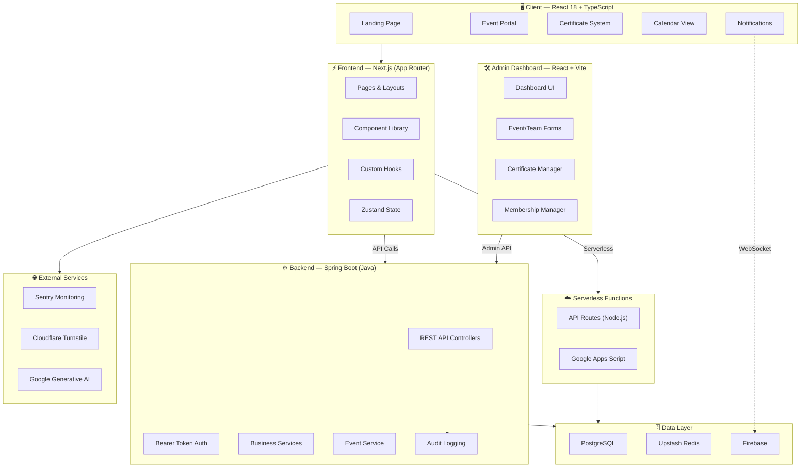

<div align="center">

# 🌌 NexaSphere

**Connecting students with opportunities across Tech and Non-Tech domains through an integrated digital ecosystem.**

[](https://gssoc.girlscript.tech)
[](./LICENSE)
[](https://nexasphere-glbajaj.vercel.app/)
[](./CONTRIBUTING.md)

</div>

> *Community-first platform · Event management · Real-time collaboration — built for GL Bajaj Group of Institutions*

</div>

<p align="center">
  
  
  
  
  
  
  
  
  
</p>

<div align="center">
  
  
  
  
  
  

</div>

<p align="center">
  <b>NexaSphere</b> is the premier community and event-management platform for the GL Bajaj Group of Institutions.<br />
  Built on a modern, high-performance web architecture, NexaSphere powers dynamic landing screens, deep event portfolios, form management, certificate generation, and real-time activity logging — all under a premium, cyber-themed design system.
</p>

> [!NOTE]
> NexaSphere is actively maintained and participating in **GSSoC 2026**. Contributions welcome!

---

## 📑 Table of Contents

- [Why NexaSphere?](#-why-nexasphere)
- [Key Features](#-key-features)
- [Architecture](#-architecture)
- [Tech Stack](#-tech-stack)
- [Getting Started](#-getting-started)
  - [Prerequisites](#prerequisites)
  - [Installation](#1--clone--install)
  - [Environment Setup](#2--environment-configuration)
  - [Database Setup](#3--database-setup)
  - [Run the App](#4--launch)
- [Project Structure](#-project-structure)
- [API Documentation](#-api-documentation)
- [Admin Dashboard](#-admin-dashboard)
- [Testing](#-testing)
- [Environment Variables](#-environment-variables)
- [Troubleshooting](#-troubleshooting)
- [Contributing](#-contributing)
- [Contributors](#-contributors)
- [License](#-license)

---

## 💡 Why NexaSphere?

Student communities need more than a static website — they need a living, breathing digital ecosystem. NexaSphere was born to fill that gap:

| Challenge | NexaSphere's Approach |
|---|---|
| Event info scattered across WhatsApp groups | **Centralized event portal** with rich portfolios, galleries, and registration |
| No visibility for club activities | **Activity timeline** with real-time logging and public showcase |
| Manual certificate distribution | **Automated certificate generation** with verification & download |
| Fragmented admin workflows | **Unified admin dashboard** for events, members, and content management |
| Poor mobile experience | **PWA-first** responsive design with offline support |
| No real-time updates | **Socket.IO integration** for live notifications and activity feeds |

---

## ✨ Key Features

### 🏠 Dynamic Landing Page
Premium cyber-themed hero section with smooth animations, event showcases, and community highlights — powered by Framer Motion.

### 📅 Event Management
<table>
<tr>
<td width="60%">

**🎟️ Event Portal**
- Rich event cards with images, descriptions, and schedules
- Interactive calendar view (FullCalendar integration)
- Category filtering and search
- Event registration with form validation

</td>
<td width="40%">

**📊 Analytics & Tracking**
- Real-time attendee counting
- Activity event logging
- Dashboard analytics with Recharts visualizations
- Historical event data

</td>
</tr>
</table>

### 🏆 Certificate System
- Automated certificate generation for event participants
- Unique verification codes
- Print-ready PDF export via `react-to-print`
- Admin bulk-generation tools

### 👥 Core Team & Membership
- Core team profiles with role-based display
- Membership application forms with Turnstile CAPTCHA protection
- Application review and approval workflow

### 🤖 AI-Powered Features
- Google Generative AI integration for intelligent content
- TensorFlow.js for client-side ML capabilities

### 🔔 Real-Time Collaboration
- Socket.IO powered live updates
- Push notifications via Firebase Cloud Messaging
- Activity feed with real-time event streaming

### 🛡️ Security & Monitoring
- Sentry error tracking and performance monitoring
- Cloudflare Turnstile bot protection
- Rate limiting via Upstash Redis
- NextAuth.js authentication

---

## 🏗 Architecture



---

## 🛠 Tech Stack

<table>
  <thead>
    <tr>
      <th>Layer</th>
      <th>Technology</th>
      <th>Purpose</th>
    </tr>
  </thead>
  <tbody>
    <tr>
      <td rowspan="10"><strong>Frontend</strong></td>
      <td>Next.js (App Router)</td>
      <td>SSR/SSG framework with file-based routing</td>
    </tr>
    <tr>
      <td>React 18 + TypeScript</td>
      <td>UI framework with full type safety</td>
    </tr>
    <tr>
      <td>Tailwind CSS</td>
      <td>Utility-first styling with cyber theme</td>
    </tr>
    <tr>
      <td>Framer Motion</td>
      <td>Premium animations and page transitions</td>
    </tr>
    <tr>
      <td>Zustand</td>
      <td>Lightweight global state management</td>
    </tr>
    <tr>
      <td>FullCalendar</td>
      <td>Interactive event calendar views</td>
    </tr>
    <tr>
      <td>Recharts</td>
      <td>Data visualization and analytics charts</td>
    </tr>
    <tr>
      <td>Lucide React</td>
      <td>Modern, consistent icon library</td>
    </tr>
    <tr>
      <td>React Helmet Async</td>
      <td>Dynamic SEO meta tags</td>
    </tr>
    <tr>
      <td>Socket.IO Client</td>
      <td>Real-time WebSocket communication</td>
    </tr>
    <tr>
      <td rowspan="5"><strong>Backend</strong></td>
      <td>Spring Boot 3 (Java)</td>
      <td>Enterprise-grade REST API server</td>
    </tr>
    <tr>
      <td>Spring Security</td>
      <td>Bearer token auth with role-based access</td>
    </tr>
    <tr>
      <td>Spring Data JPA</td>
      <td>ORM with repository pattern</td>
    </tr>
    <tr>
      <td>PostgreSQL</td>
      <td>Primary relational database</td>
    </tr>
    <tr>
      <td>Swagger / OpenAPI</td>
      <td>Auto-generated API documentation</td>
    </tr>
    <tr>
      <td rowspan="3"><strong>Infrastructure</strong></td>
      <td>Firebase</td>
      <td>Push notifications and cloud messaging</td>
    </tr>
    <tr>
      <td>Upstash Redis</td>
      <td>Rate limiting and KV storage</td>
    </tr>
    <tr>
      <td>Sentry</td>
      <td>Error tracking and performance monitoring</td>
    </tr>
    <tr>
      <td rowspan="2"><strong>AI & ML</strong></td>
      <td>Google Generative AI</td>
      <td>AI-powered content features</td>
    </tr>
    <tr>
      <td>TensorFlow.js</td>
      <td>Client-side machine learning</td>
    </tr>
    <tr>
      <td rowspan="3"><strong>Testing</strong></td>
      <td>Vitest</td>
      <td>Unit and integration testing</td>
    </tr>
    <tr>
      <td>Testing Library</td>
      <td>Component testing utilities</td>
    </tr>
    <tr>
      <td>Playwright</td>
      <td>End-to-end browser testing</td>
    </tr>
    <tr>
      <td rowspan="4"><strong>DevOps</strong></td>
      <td>GitHub Actions</td>
      <td>CI/CD pipelines and automated workflows</td>
    </tr>
    <tr>
      <td>Husky + lint-staged</td>
      <td>Pre-commit hooks for code quality</td>
    </tr>
    <tr>
      <td>ESLint + Prettier</td>
      <td>Code linting and formatting</td>
    </tr>
    <tr>
      <td>Vite PWA Plugin</td>
      <td>Progressive Web App support</td>
    </tr>
  </tbody>
</table>

---

## 🚀 Getting Started

### Prerequisites

| Tool | Version | Check | Download |
|---|---|---|---|
| Node.js | 20+ LTS | `node -v` | [nodejs.org](https://nodejs.org) |
| npm | 9+ | `npm -v` | bundled with Node |
| PostgreSQL | 14+ | `psql --version` | [postgresql.org](https://postgresql.org) |
| Git | Any | `git --version` | [git-scm.com](https://git-scm.com) |

---

## ⚙️ Installation & Setup

### 1. 📥 Clone & Install

```bash
# Clone the repository
git clone https://github.com/Ayushh-Sharmaa/NexaSphere.git
cd NexaSphere

# Install frontend dependencies
npm install

# Install admin dashboard dependencies
cd admin-dashboard && npm install && cd ..
```

### 2. 🔐 Environment Configuration

**Linux / macOS**
```bash
cp .env.example .env.local
```

**Windows (PowerShell)**
```powershell
Copy-Item .env.example .env.local
```

Edit `.env.local` with your configuration values. See the [Environment Variables](#-environment-variables) section for details.

### 3. 🗄 Database Setup

<details>
<summary><strong>🐧 Linux (Ubuntu / Debian)</strong></summary>

```bash
# Install PostgreSQL
sudo apt update && sudo apt install postgresql postgresql-contrib

# Start & enable the service
sudo systemctl start postgresql
sudo systemctl enable postgresql

# Create database
sudo -u postgres psql -c "CREATE DATABASE nexasphere;"
```

</details>

<details>
<summary><strong>🍎 macOS (Homebrew)</strong></summary>

```bash
# Install PostgreSQL
brew install postgresql

# Start the service
brew services start postgresql

# Create database
psql postgres -c "CREATE DATABASE nexasphere;"
```

</details>

<details>
<summary><strong>🪟 Windows</strong></summary>

1. Download and install PostgreSQL from [postgresql.org/download/windows](https://www.postgresql.org/download/windows/)
2. During installation, note your username, password, and port (default: `5432`)
3. Create a database named `nexasphere` using **pgAdmin** or the PostgreSQL CLI
4. Update your `.env.local` file with the connection string

</details>

### 4. 🚀 Launch

```bash
# Start the frontend dev server
npm run dev
```

| Service | URL |
|---|---|
| **Frontend** | http://localhost:3000 |
| **Admin Dashboard** | Run separately — see [Admin Dashboard](#-admin-dashboard) |
| **Java Backend** | See [server-java/README.md](server-java/README.md) |

---

## 📁 Project Structure

```
NexaSphere/
│
├── 📂 app/                          # Next.js App Router
│   ├── error.tsx                    # Segment-level error boundary
│   └── global-error.tsx             # Root layout error screen
│
├── 📂 src/
│   ├── 📂 components/              # Reusable UI elements
│   │   ├── Theme components         # Dark/light mode, cyber aesthetic
│   │   ├── Form components          # Registration, membership forms
│   │   └── Developer cards           # Team member showcase cards
│   ├── 📂 lib/                      # Database connections & services
│   ├── 📂 pages/                    # Page templates & views
│   ├── 📂 shared/                   # Cross-cutting assets & wrappers
│   └── 📂 styles/                   # Global typography, colors, animations
│
├── 📂 admin-dashboard/              # Standalone admin panel (React + Vite)
│   ├── 📂 src/
│   │   ├── 📂 components/          # Admin UI components
│   │   │   ├── EventForm.jsx        # Event CRUD forms
│   │   │   ├── CoreTeamForm.jsx     # Team member management
│   │   │   ├── Sidebar.jsx          # Navigation sidebar
│   │   │   └── Toast.jsx            # Notification toasts
│   │   ├── 📂 pages/               # Admin page views
│   │   │   ├── DashboardHome.jsx    # Analytics overview
│   │   │   ├── EventsManager.jsx    # Event management
│   │   │   ├── CertificateManager.jsx  # Certificate generation
│   │   │   └── MembershipResponsesManager.jsx
│   │   ├── 📂 hooks/               # Custom React hooks
│   │   └── 📂 services/            # API client & auth services
│   └── package.json
│
├── 📂 server-java/                   # Spring Boot backend
│   ├── 📂 src/main/java/org/nexasphere/
│   │   ├── 📂 config/              # Security, CORS, OpenAPI config
│   │   ├── 📂 controller/          # REST API controllers
│   │   ├── 📂 model/               # JPA entity models
│   │   ├── 📂 repository/          # Data access repositories
│   │   ├── 📂 service/             # Business logic services
│   │   └── 📂 event/               # Domain events & audit
│   └── pom.xml                      # Maven dependencies
│
├── 📂 api/                           # Serverless API functions
│   └── core-team/apply.cjs          # Core team application handler
│
├── 📂 google-apps-script/            # Google Workspace integrations
│   └── Code.gs                       # Apps Script automation
│
├── 📂 e2e/                           # End-to-end Playwright tests
│   ├── main.spec.ts                 # Core feature tests
│   └── prompt-history.spec.ts       # History feature tests
│
├── 📂 public/                        # Static assets
│   ├── 📂 assets/                   # Images and logos
│   ├── manifest.json                # PWA manifest
│   ├── sw.js                        # Service worker
│   └── firebase-messaging-sw.js     # Firebase push worker
│
├── 📂 scripts/                       # Automation scripts
│   └── migrate-all.sh               # Database migration runner
│
├── 📂 .github/                       # GitHub configuration
│   ├── 📂 ISSUE_TEMPLATE/          # Bug report & feature request templates
│   ├── 📂 workflows/               # CI/CD & GSSoC automation
│   └── pull_request_template.md     # PR template
│
├── .env.example                      # Environment variable template
├── index.html                        # Vite entry point
├── next.config.js                    # Next.js configuration
├── package.json                      # Node.js dependencies & scripts
├── playwright.config.ts              # Playwright test configuration
├── eslint.config.js                  # ESLint configuration
└── LICENSE                           # MIT License
```

---

## 📡 API Documentation

The Java backend exposes a comprehensive REST API. Full documentation is auto-generated via **Swagger / OpenAPI**.

### Core Endpoints

| Method | Endpoint | Description |
|---|---|---|
| `GET` | `/api/events` | List all events |
| `POST` | `/api/events` | Create a new event |
| `PUT` | `/api/events/:id` | Update an existing event |
| `DELETE` | `/api/events/:id` | Delete an event |
| `GET` | `/api/core-team` | List core team members |
| `POST` | `/api/core-team` | Add a core team member |
| `GET` | `/api/activity-events` | List activity events |
| `POST` | `/api/activity-events` | Log a new activity |
| `GET` | `/api/collaborations` | List collaborations |
| `GET` | `/api/dashboard/stats` | Dashboard analytics summary |

> For full API docs with request/response schemas, run the Java backend and visit `/swagger-ui.html`.

See [API_DOCUMENTATION_GUIDE.md](API_DOCUMENTATION_GUIDE.md) for detailed integration examples.

---

## 🛠 Admin Dashboard

The admin dashboard is a standalone React + Vite application for managing NexaSphere content.

### Features
- 📊 **Dashboard Home** — Real-time analytics and activity overview
- 📅 **Events Manager** — Create, edit, and delete events with rich forms
- 👥 **Core Team Manager** — Manage team members and roles
- 🏆 **Certificate Manager** — Generate and manage certificates
- 📝 **Membership Manager** — Review and approve membership applications
- 📡 **Activity Events** — Log and track community activities

### Running the Admin Dashboard

```bash
cd admin-dashboard
npm install
npm run dev
```

The admin dashboard runs on http://localhost:5174 by default.

See [admin-dashboard/README.md](admin-dashboard/README.md) for complete setup instructions.

---

## 🧪 Testing

NexaSphere has a comprehensive testing setup:

### Unit & Integration Tests (Vitest)

```bash
# Run all tests
npm test

# Run tests in watch mode
npm run test:watch

# Run tests with UI
npm run test:ui
```

### End-to-End Tests (Playwright)

```bash
# Run E2E tests
npm run e2e

# Run E2E tests in debug mode
npm run e2e:debug
```

### Linting & Formatting

```bash
# Lint the codebase
npm run lint

# Auto-fix lint issues
npm run lint:fix
```

---

## 🔑 Environment Variables

Create a `.env.local` file based on `.env.example`:

| Variable | Required | Description |
|---|---|---|
| `DATABASE_URL` | ✅ | PostgreSQL connection string |
| `UPSTASH_REDIS_URL` | ✅ | Upstash Redis connection URL |
| `UPSTASH_REDIS_TOKEN` | ✅ | Upstash Redis auth token |
| `NEXTAUTH_SECRET` | ✅ | NextAuth.js session encryption secret |
| `NEXTAUTH_URL` | ✅ | Application base URL |
| `SENTRY_DSN` | ⬜ | Sentry error tracking DSN |
| `GOOGLE_AI_API_KEY` | ⬜ | Google Generative AI API key |
| `FIREBASE_*` | ⬜ | Firebase configuration for push notifications |
| `TURNSTILE_SITE_KEY` | ⬜ | Cloudflare Turnstile CAPTCHA site key |
| `TURNSTILE_SECRET_KEY` | ⬜ | Cloudflare Turnstile CAPTCHA secret key |

> [!IMPORTANT]
> Never commit `.env.local` files. The `.gitignore` is pre-configured to exclude them.

---

## ❓ Troubleshooting

<details>
<summary><strong>"Cannot connect to database"</strong></summary>

- Verify PostgreSQL is running: `sudo systemctl status postgresql` (Linux) or `brew services list` (macOS)
- Confirm `DATABASE_URL` in `.env` matches your local credentials
- Ensure port `5432` is not blocked by another process
- Check that the `nexasphere` database exists

</details>

<details>
<summary><strong>Node version mismatch</strong></summary>

- NexaSphere requires **Node.js ≥ 20**
- Check the `.nvmrc` file: `cat .nvmrc`
- If using nvm: `nvm use` to switch to the correct version
- Verify: `node -v`

</details>

<details>
<summary><strong>Admin dashboard won't start</strong></summary>

- Ensure you're in the `admin-dashboard/` directory
- Run `npm install` separately for the admin dashboard
- Check that no other process is using port 5174
- Verify `.env` configuration in `admin-dashboard/.env`

</details>

<details>
<summary><strong>Java backend build errors</strong></summary>

- Ensure Java 17+ is installed: `java --version`
- Navigate to `server-java/` and run: `./mvnw clean install`
- Check `application.properties` for correct database configuration
- See [server-java/README.md](server-java/README.md) for detailed setup

</details>

<details>
<summary><strong>PWA not working in development</strong></summary>

- Service workers only activate on `localhost` or HTTPS
- Clear browser cache and service worker registration
- Check `public/manifest.json` and `public/sw.js` for errors
- The PWA is fully functional in production builds: `npm run build && npm run preview`

</details>

---

## 🤝 Contributing

We love contributions! Whether it's a bug fix, a new feature, or improved docs — **every PR makes a difference**.

### Quick Start

1. **Fork** the repository
2. **Create** your feature branch (`git checkout -b feat/amazing-feature`)
3. **Commit** your changes (`git commit -m 'feat: add amazing feature'`)
4. **Push** to the branch (`git push origin feat/amazing-feature`)
5. **Open** a Pull Request

### Guidelines

- Follow the existing code style (ESLint + Prettier enforced via pre-commit hooks)
- Write tests for new features when applicable
- Use [conventional commits](https://www.conventionalcommits.org/) (`feat:`, `fix:`, `docs:`, etc.)
- Fill out the PR template completely

Please read our [**Contributing Guide**](CONTRIBUTING.md) and [**Security Policy**](SECURITY.md) before submitting.

> [!TIP]
> First-time contributor? Look for issues labeled `good first issue` — they're great starting points!

---

## 👥 Contributors

<a href="https://github.com/Ayushh-Sharmaa/NexaSphere/graphs/contributors">
  
</a>

---

## 📄 License

This project is licensed under the **MIT License** — see the [LICENSE](LICENSE) file for details.

```
MIT License © 2026 NexaSphere — GL Bajaj Group of Institutions, Mathura
```

---

## 👤 Author

[](https://github.com/Ayushh-Sharmaa)

**Ayush Sharma**
*Developer · Community Builder*

---

<div align="center">

*Built with ❤️ for the GL Bajaj student community*

⭐ **Star this repo** if you find it useful — it helps others discover the project!

[Report Bug](https://github.com/Ayushh-Sharmaa/NexaSphere/issues/new?template=bug_report.md) · [Request Feature](https://github.com/Ayushh-Sharmaa/NexaSphere/issues/new?template=feature_request.md) · [Join Discussion](https://github.com/Ayushh-Sharmaa/NexaSphere/discussions)
<!-- CONTRIBUTORS_START -->
<a href="https://github.com/ionfwsrijan"></a>
<a href="https://github.com/anshika1179"></a>
<a href="https://github.com/atul-upadhyay-7"></a>
<a href="https://github.com/OmanshiRaj"></a>
<a href="https://github.com/Pratikshya32"></a>
<a href="https://github.com/Meenbudha"></a>
<a href="https://github.com/pithva007"></a>
<a href="https://github.com/advikdivekar"></a>
<a href="https://github.com/rajesh-puripanda"></a>
<!-- CONTRIBUTORS_END -->

</div>
